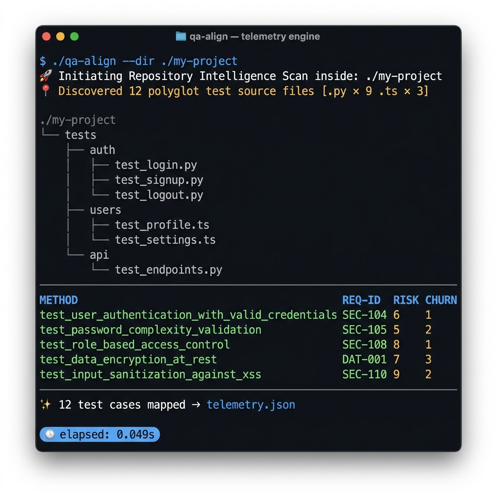

<div align="center">



# qa-align

**Stop copying test names into Jira by hand.**  
`qa-align` scans your codebase, reads your docstring annotations, counts Git churn, and exports a risk-ranked `telemetry.json` audit trail — in under a second, with zero runtime dependencies.

[](https://go.dev)
[](LICENSE)
[]()

</div>

---

## The Problem

Every sprint, someone on the QA team manually copies test method names, requirement IDs, and risk levels into a spreadsheet or Jira ticket. That person is:

- ❌ Doing it wrong — test code drifted since the last copy-paste  
- ❌ Doing it slow — 2 hours per release cycle, minimum  
- ❌ Not doing security traceability — a CISO audit finds gaps instantly

`qa-align` eliminates that entirely. It reads the truth directly from your source files.

---

## 60-Second Quickstart

### 1 — Install (from source, ~10 seconds)

```bash
git clone https://github.com/JRE503/TestGate-cli
cd TestGate-cli/qa-align-cli
go build -o qa-align
```

> **Requires:** [Go 1.21+](https://go.dev/dl). No Docker, no Node, no Python.

### 2 — Run against any repo

```bash
# Annotated projects — get a full risk-ranked audit trail
./qa-align --dir ./your-project

# Any repo with zero annotations — get a complete test inventory
./qa-align --dir ./your-project --include-unannotated

# Write output to a custom path
./qa-align --dir ./your-project --output ./reports/telemetry.json
```

### 3 — Read the output

```json
[
  {
    "test_method": "test_locked_account_cannot_authenticate",
    "file_path": "tests/auth/test_authentication.py",
    "what": "Verifies that a locked account cannot authenticate regardless of credentials",
    "why": "Account lockout policy must be enforced after N failed attempts.",
    "requirement_id": "SEC-110",
    "change_frequency_30_days": 7,
    "calculated_risk_score": 6
  }
]
```

Ship `telemetry.json` straight into your CI artifact store, your Jira importer, or your CISO's inbox.

---

## CLI Flags

| Flag | Default | Description |
|---|---|---|
| `--dir`, `-d` | `.` | Target repository directory to scan |
| `--output`, `-o` | `<dir>/telemetry.json` | Output path for the telemetry JSON file |
| `--include-unannotated` | `false` | Capture all test functions, even without annotations |

### `--include-unannotated`

Works on **any** real-world repository — no annotations required. Every detected test function is emitted with sentinel values so you get a full test inventory immediately:

```json
{
  "test_method": "test_nvs_read_write",
  "file_path": "components/nvs/test/test_nvs.c",
  "what": "UNANNOTATED",
  "why": "",
  "requirement_id": "UNMAPPED",
  "change_frequency_30_days": 3,
  "calculated_risk_score": 4
}
```

Engineers can then add annotations incrementally to the highest-risk entries.

---

## Real-World Validation

Tested against three production open-source embedded repositories with zero annotations:

| Repository | Framework | Files | Tests found | Time |
|---|---|---|---|---|
| [InfiniTimeOrg/InfiniTime](https://github.com/InfiniTimeOrg/InfiniTime) | Catch2 / shell | 454 | 1 | 1.4s |
| [meshtastic/firmware](https://github.com/meshtastic/firmware) | PlatformIO / C++ | 1860 | 77 | 3.6s |
| [espressif/esp-rainmaker](https://github.com/espressif/esp-rainmaker) | ESP-IDF Unity / C | — | 3 | 0.6s |

> **Note:** InfiniTime's Catch2 unit tests live in the separate [InfiniSim](https://github.com/InfiniTimeOrg/InfiniSim) simulator repo — the primary repo's `tests/` folder contains only shell linting scripts.

---

## Annotation Format

Add three comment lines above any test function:

```python
# [What]: Verifies that a locked account cannot authenticate
# [Why]: Account lockout policy must be enforced after N failed attempts.
# [Reference]: SEC-110
def test_locked_account_cannot_authenticate():
    ...
```

TypeScript / JS / C / C++ use `//` prefix:

```typescript
// @test Rejects duplicate email registration
// @description System must enforce uniqueness before DB write
// @issue USR-302
function test_create_user_duplicate_email_rejected() { ... }
```

### Annotation Reference Table

| Language | What tag | Why tag | Reference tag |
|---|---|---|---|
| Python | `# [What]: ...` | `# [Why]: ...` | `# [Reference]: TICKET-123` |
| TypeScript / JS | `// @test ...` | `// @description ...` | `// @issue TICKET-123` |
| Java / Kotlin | `// @test ...` | `// @description ...` | `// @issue TICKET-123` |
| C / C++ / ESP-IDF | `// @test ...` | `// @description ...` | `// @issue TICKET-123` |

---

## Risk Score Formula

```
Risk = Impact × Frequency × Probability
```

| Factor | Low (1) | Medium (2) | High (3) |
|---|---|---|---|
| **Impact** | `utils/`, `styles/` paths | All others | `auth`, `billing`, `security` paths |
| **Frequency** | churn ≤ 2 commits/30d | churn 3–10 | churn > 10 |
| **Probability** | — | 2 (fixed baseline) | — |

Max score = **18**. Anything ≥ 12 should be in your regression suite every release.

---

## CI Integration

### GitHub Actions

```yaml
name: QA Telemetry

on: [push, pull_request]

jobs:
  scan:
    runs-on: ubuntu-latest
    steps:
      - uses: actions/checkout@v4
      - uses: actions/setup-go@v5
        with:
          go-version: '1.21'
      - name: Build qa-align
        run: cd qa-align-cli && go build -o qa-align
      - name: Run telemetry scan
        run: ./qa-align-cli/qa-align --dir . --output telemetry.json
      - name: Upload telemetry artifact
        uses: actions/upload-artifact@v4
        with:
          name: telemetry
          path: telemetry.json
```

### GitLab CI

```yaml
qa-telemetry:
  image: golang:1.21
  script:
    - cd qa-align-cli && go build -o qa-align
    - ./qa-align --dir .. --output ../telemetry.json
  artifacts:
    paths:
      - telemetry.json
```

---

## Project Structure

```
qa-align-cli/
├── main.go                        # Entry point
├── cmd/root.go                    # CLI flags + orchestration
├── internal/
│   ├── parser/python_parser.go    # Polyglot annotation + function scanner
│   ├── gitops/churn.go            # Git log churn calculator (30-day window)
│   ├── risk/matrix.go             # Risk = Impact × Frequency × Probability
│   └── schema/normalizer.go      # TestCaseMetadata type + JSON serializer
└── tests/
    ├── auth/                      # Python fixture tests
    ├── billing/                   # Python fixture tests
    ├── embedded/                  # C / ESP-IDF fixture tests
    └── utils/                     # Python fixture tests
```

---

## Supported Languages

| Extension | Language | Frameworks |
|---|---|---|
| `.py` | Python | pytest, unittest |
| `.ts` | TypeScript | Jest, Vitest |
| `.js` | JavaScript | Jest, Mocha |
| `.java` | Java | JUnit, TestNG |
| `.kt` | Kotlin | JUnit5, Kotest |
| `.cpp` | C++ | Catch2, Google Test (`TEST_F`, `TEST`), CppUTest |
| `.c` | C | **ESP-IDF (Unity)**, Zephyr (ztest), bare metal |

---

## Embedded / ESP-IDF Support

`qa-align` natively parses ESP-IDF **Unity** `TEST_CASE` macros, Catch2 `TEST_CASE` + `SECTION`, and Google Test `TEST_F` / `TEST`. Annotations are optional — use `--include-unannotated` to get a full test inventory on any repo.

```c
// @test Verifies NVS read returns correct value after write
// @description Core data persistence. Failure means device loses config on reboot.
// @issue FW-101
TEST_CASE("nvs_read_after_write", "[nvs]")
{
    // ...
}
```

### Embedded Framework Detection Matrix

| Framework | Detection pattern | Flag needed |
|---|---|---|
| ESP-IDF Unity | `TEST_CASE("name", "[tag]")` | none (annotated) / `--include-unannotated` |
| Catch2 | `TEST_CASE("name", "[tag]")` + `SECTION("name")` | none / `--include-unannotated` |
| Google Test | `TEST_F(Suite, name)`, `TEST(Suite, name)` | none / `--include-unannotated` |
| Zephyr ztest | `void test_name()` style | none / `--include-unannotated` |
| CppUTest | `.cpp` + `void test_name()` | none / `--include-unannotated` |
| Arduino bare metal | `.c/.cpp` + any test function | `--include-unannotated` |

---

## License

Apache 2.0 © 2025 JRE503 — Built with Go, `cobra`, and `go-git`.
